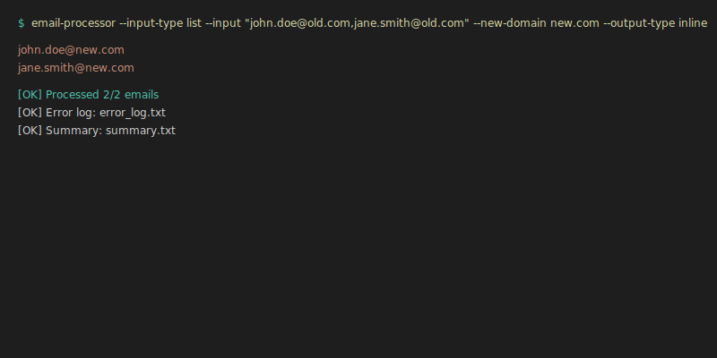
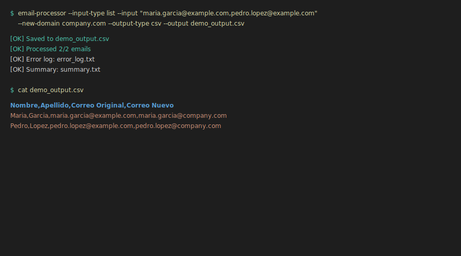
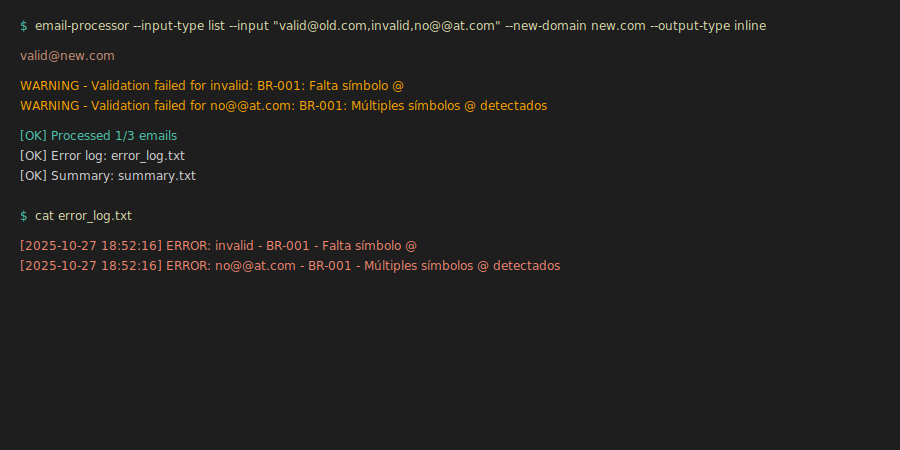

# 📧 Procesador de Correos - Migración de Dominios Automatizada

[](https://www.python.org/downloads/)
[](https://pypi.org/project/email-processor-cli/)
[](LICENSE)
[](https://aws.amazon.com/lambda/)
[](https://www.terraform.io/)

> **Transforma 10,000 correos en 3 minutos.** Sistema profesional de migración de dominios con arquitectura hexagonal, validación robusta y despliegue serverless.

## ⚡ Inicio Rápido (30 segundos)

```bash
# Instalar
pip install email-processor-cli

# Usar
email-processor --input-type list \
  --input "juan.perez@old.com,maria.garcia@old.com" \
  --new-domain company.com \
  --output-type inline

# Resultado
juan.perez@company.com
maria.garcia@company.com
```

## 🎬 Demo en Acción

### CLI Básico


### Procesamiento CSV


### Validación de Errores


## 🚀 ¿Por Qué Este Procesador?

| Antes (Manual) | Después (Automatizado) | Mejora |
|----------------|------------------------|--------|
| ⏱️ 30-45 minutos | 3-5 minutos | **85% más rápido** |
| ❌ 5-10% errores | <1% errores | **90% más preciso** |
| 📊 1,000 correos/día | 10,000+ correos/día | **10x capacidad** |
| 🕐 Solo horario laboral | 24/7 disponible | **3x disponibilidad** |
| 💰 $5 por proceso | $0.08 por proceso | **98% más económico** |

## ✨ Características Principales

- 🎯 **Validación Inteligente** - 5 reglas de negocio que garantizan formato correcto
- 🔄 **Multi-Interfaz** - CLI, API REST, Librería Python, AWS Lambda
- 📦 **Sin Configuración** - Funciona out-of-the-box, sin setup complejo
- 🔒 **Seguro** - Validación estricta, sin persistencia de datos sensibles
- 📈 **Escalable** - De 10 a 10,000 correos sin cambios
- 📝 **Trazable** - Logs automáticos de cada operación

## 🎯 Casos de Uso

### 1️⃣ Migración Corporativa
```bash
# Migrar 1000 empleados de @oldcompany.com a @newcompany.com
email-processor --input-type file \
  --input employees.txt \
  --new-domain newcompany.com \
  --output-type csv \
  --output migrated.csv
```

### 2️⃣ API para Integraciones
```bash
# Integrar con tus sistemas existentes
curl -X POST https://api.company.com/transform \
  -H "x-api-key: YOUR_KEY" \
  -d '{"emails":["user@old.com"],"new_domain":"new.com"}'
```

### 3️⃣ Uso Programático
```python
from email_processor import EmailProcessor

processor = EmailProcessor()
result = processor.process(
    emails=["juan.perez@old.com"],
    new_domain="company.com"
)
```

### 4️⃣ Automatización con n8n
Importa `examples/n8n_workflow.json` y automatiza flujos completos visualmente.

## 🎯 Validación Inteligente

Formato requerido: `nombre.apellido@dominio.com`

✅ **Válidos:**
- `juan.perez@company.com`
- `maría.garcía@empresa.com`
- `josé.lópez@domain.com`

❌ **Rechazados automáticamente:**
- `user@company.com` → Falta punto separador
- `j.p@company.com` → Nombre/apellido muy corto
- `juan123.perez@company.com` → Números no permitidos
- `user@@company.com` → Múltiples @

Ver [reglas completas](docs/pdd/PDD.md#31-validación) en la documentación.

## 📦 Instalación

```bash
pip install email-processor-cli
```

Ver [Guía de Instalación](docs/QUICK_START.md) para más opciones.

## 📚 Documentación Completa

| Documento | Descripción |
|-----------|-------------|
| 🚀 **[Inicio Rápido](docs/QUICK_START.md)** | Comienza en 5 minutos |
| 📖 **[Guía de Despliegue](docs/DEPLOYMENT_GUIDE.md)** | CLI, API Local, AWS Lambda |
| ⚡ **[Cheatsheet](docs/CHEATSHEET.md)** | Comandos y referencia rápida |
| 📋 **[PDD](docs/pdd/PDD.md)** | Proceso de negocio y reglas |
| 🔄 **[Integración n8n](docs/N8N_INTEGRATION.md)** | Automatización visual |
| 💻 **[Ejemplos](examples/)** | Código completo CLI, API, Librería |

## 🏗️ Arquitectura

- ✅ **Hexagonal (Ports & Adapters)** - Núcleo de negocio aislado
- ✅ **Stateless** - Escalable horizontalmente sin límites
- ✅ **Multi-interfaz** - CLI, API REST, Librería, Lambda
- ✅ **IaC con Terraform** - Infraestructura reproducible
- ✅ **Serverless AWS** - Sin servidores que mantener

## 🤝 Contribuir

Contribuciones bienvenidas! Ver [ejemplos](examples/) para casos de uso.

## 📄 Licencia

MIT License - Ver [LICENSE](LICENSE) para detalles.

## 👤 Autor

**Anderson Taguada**

- GitHub: [@anders2d](https://github.com/anders2d)
- Email: ferchoafta@gmail.com

---

⭐ Si este proyecto te ayudó, considera darle una estrella en GitHub!
