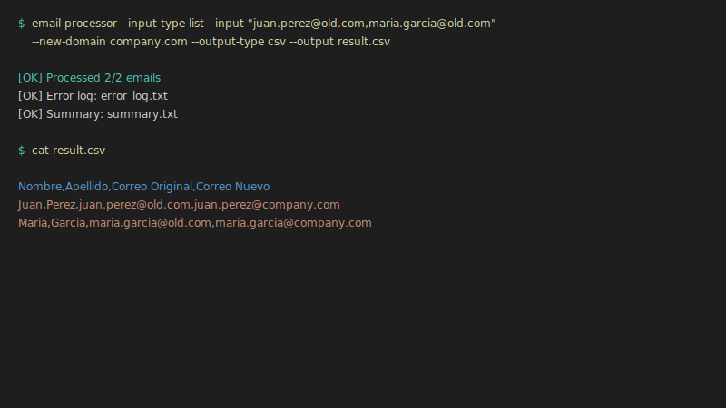

# 📧 Procesador de Correos - Migración de Dominios Automatizada

[](https://www.python.org/downloads/)
[](https://pypi.org/project/email-processor-cli/)
[](LICENSE)
[](https://aws.amazon.com/lambda/)
[](https://www.terraform.io/)

> **Transforma 10,000 correos en 3 minutos.** Sistema profesional de migración de dominios con arquitectura hexagonal, validación robusta y despliegue serverless.

## ⚡ Inicio Rápido (30 segundos)

### Ejemplo 1: Desde lista inline
```bash
# Instalar
pip install email-processor-cli

# Usar
email-processor --input-type list \
  --input "juan.perez@old.com,maria.garcia@old.com" \
  --new-domain company.com \
  --output-type csv \
  --output result.csv

# Resultado:
[OK] Processed 2/2 emails
[OK] Error log: error_log.txt
[OK] Summary: summary.txt
```

### Ejemplo 2: Desde archivo TXT
```bash
# Crear archivo de entrada
echo "juan.perez@old.com" > emails.txt
echo "maria.garcia@old.com" >> emails.txt

# Procesar
email-processor --input-type file \
  --input emails.txt \
  --new-domain nuevo.com \
  --output-type csv \
  --output result.csv
```

**Archivo generado (result.csv):**
```csv
Nombre,Apellido,Correo Original,Correo Nuevo
Juan,Perez,juan.perez@old.com,juan.perez@company.com
Maria,Garcia,maria.garcia@old.com,maria.garcia@company.com
```

## 📚 Documentación Técnica

### 🎯 Documentos Principales (Prueba Técnica)

| Documento | Qué Demuestra | Enlace |
|-----------|---------------|--------|
| 📘 **PDD** | Análisis de proceso AS-IS, reglas de negocio, identificación de oportunidades de automatización | **[Ver PDD](docs/pdd/PDD.md)** |
| 🏗️ **SDD** | Arquitectura hexagonal, diseño técnico, decisiones de implementación, patrones de diseño | **[Ver SDD](docs/sdd/SDD.md)** |
| 🔄 **n8n** | Integración con herramientas de automatización, workflows visuales, casos de uso reales | **[Ver n8n](docs/N8N_INTEGRATION.md)** |

### 📖 Guías de Implementación

- 🚀 **[Inicio Rápido](docs/QUICK_START.md)** - Instalación y primeros pasos
- 📦 **[Despliegue](docs/DEPLOYMENT_GUIDE.md)** - CLI, API REST, AWS Lambda con Terraform
- 💻 **[Ejemplos de Código](examples/)** - Uso como CLI, API y librería Python

---

## 🎬 Demo en Acción

### CLI Básico


### Procesamiento CSV


### Validación de Errores


### Integración con n8n


## 🚀 ¿Por Qué Este Procesador?

| Antes (Manual) | Después (Automatizado) | Mejora |
|----------------|------------------------|--------|
| ⏱️ 30-45 minutos | 3-5 minutos | **85% más rápido** |
| ❌ 5-10% errores | <1% errores | **90% más preciso** |
| 📊 1,000 correos/día | 10,000+ correos/día | **10x capacidad** |
| 🕐 Solo horario laboral | 24/7 disponible | **3x disponibilidad** |
| 💰 $5 por proceso | $0.08 por proceso | **98% más económico** |

## ✨ Características Principales

- 🎯 **Validación Inteligente** - 5 reglas de negocio que garantizan formato correcto
- 🔄 **Multi-Interfaz** - CLI, API REST, Librería Python, AWS Lambda
- 📦 **Sin Configuración** - Funciona out-of-the-box, sin setup complejo
- 🔒 **Seguro** - Validación estricta, sin persistencia de datos sensibles
- 📈 **Escalable** - De 10 a 10,000 correos sin cambios
- 📝 **Trazable** - Logs automáticos de cada operación
- 📊 **Múltiples Formatos** - CSV, Excel, JSON, TXT, Inline, Silent

## 🎯 Casos de Uso

### 1️⃣ Migración Corporativa (CSV)
```bash
# Migrar 1000 empleados de @oldcompany.com a @newcompany.com
email-processor --input-type file \
  --input employees.txt \
  --new-domain newcompany.com \
  --output-type csv \
  --output migrated.csv
```

### 1️⃣.1 Migración a Excel
```bash
# Generar reporte en Excel para análisis
email-processor --input-type file \
  --input employees.txt \
  --new-domain newcompany.com \
  --output-type excel \
  --output migrated.xlsx
```

### 1️⃣.2 Migración a TXT
```bash
# Generar archivo de texto plano
email-processor --input-type file \
  --input employees.txt \
  --new-domain newcompany.com \
  --output-type txt \
  --output migrated.txt
```

### 1️⃣.3 Salida en Consola (Inline)
```bash
# Ver resultados directamente en consola
email-processor --input-type list \
  --input "juan.perez@old.com,maria.garcia@old.com" \
  --new-domain newcompany.com \
  --output-type inline

# Salida:
# Nombre,Apellido,Correo Original,Correo Nuevo
# Juan,Perez,juan.perez@old.com,juan.perez@newcompany.com
# Maria,Garcia,maria.garcia@old.com,maria.garcia@newcompany.com
```

### 2️⃣ API para Integraciones
```bash
# Integrar con tus sistemas existentes
curl -X POST https://api.company.com/transform \
  -H "x-api-key: YOUR_KEY" \
  -d '{"emails":["user@old.com"],"new_domain":"new.com"}'
```

### 3️⃣ Uso Programático
```python
from email_processor import EmailProcessor

processor = EmailProcessor()
result = processor.process(
    emails=["juan.perez@old.com"],
    new_domain="company.com"
)
```

### 4️⃣ Automatización con n8n
Importa `examples/n8n_workflow.json` y automatiza flujos completos visualmente.

## 🎯 Validación Inteligente

Formato requerido: `nombre.apellido@dominio.com`

✅ **Válidos:**
- `juan.perez@company.com`
- `maría.garcía@empresa.com`
- `josé.lópez@domain.com`

❌ **Rechazados automáticamente:**
- `user@company.com` → Falta punto separador
- `j.p@company.com` → Nombre/apellido muy corto
- `juan123.perez@company.com` → Números no permitidos
- `user@@company.com` → Múltiples @

Ver [reglas completas](docs/pdd/PDD.md#31-validación) en la documentación.

## 📊 Formatos de Salida

Todos los formatos generan **4 campos** según el PDD:
- **Nombre** - Nombre capitalizado
- **Apellido** - Apellido capitalizado
- **Correo Original** - Email de entrada
- **Correo Nuevo** - Email con nuevo dominio

| Formato | Extensión | Uso Recomendado | Comando |
|---------|-----------|-----------------|----------|
| 📊 **CSV** | `.csv` | Análisis de datos, importación masiva | `--output-type csv --output file.csv` |
| 📗 **Excel** | `.xlsx` | Reportes ejecutivos, presentaciones | `--output-type excel --output file.xlsx` |
| 📝 **TXT** | `.txt` | Archivos de texto plano, scripts | `--output-type txt --output file.txt` |
| 📜 **JSON** | `.json` | APIs, integraciones, aplicaciones | `--output-type json --output file.json` |
| 💻 **Inline** | Consola | Verificación rápida, debugging | `--output-type inline` |
| 🔇 **Silent** | Ninguno | Procesos automatizados, pipelines | `--output-type silent` |

**Ejemplo de salida (todos los formatos):**
```
Nombre,Apellido,Correo Original,Correo Nuevo
Juan,Perez,juan.perez@old.com,juan.perez@new.com
Maria,Garcia,maria.garcia@old.com,maria.garcia@new.com
```

## 📦 Instalación

```bash
pip install email-processor-cli
```

Ver [Guía de Instalación](docs/QUICK_START.md) para más opciones.

## 🏗️ Arquitectura y Diseño

### Patrones Implementados
- ✅ **Hexagonal (Ports & Adapters)** - Núcleo de negocio aislado de infraestructura
- ✅ **Domain-Driven Design** - Lógica de negocio en el dominio
- ✅ **Dependency Injection** - Bajo acoplamiento entre componentes
- ✅ **Multi-interfaz** - CLI, API REST, Librería Python, AWS Lambda

### Infraestructura
- ✅ **Stateless** - Escalable horizontalmente sin límites
- ✅ **IaC con Terraform** - Infraestructura como código reproducible
- ✅ **Serverless AWS** - Lambda + API Gateway
- ✅ **CI/CD Ready** - Preparado para pipelines de despliegue

**Detalles completos:** [Ver SDD](docs/sdd/SDD.md)

---

## 📄 Información del Proyecto

**Autor:** Anderson Taguada | **Licencia:** MIT | **GitHub:** [@anders2d](https://github.com/anders2d)
