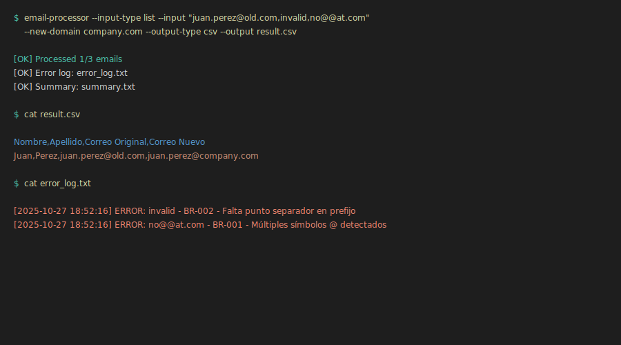

# 🎬 Demos del Email Processor CLI

Esta carpeta contiene demostraciones visuales del CLI en acción.

## 📋 Demos Disponibles

### 1. Demo Básico


**Muestra:**
- Comando `--help`
- Procesamiento básico de correos
- Salida inline

**Comando:**
```bash
email-processor --input-type list --input "john.doe@old.com,jane.smith@old.com" --new-domain new.com --output-type inline
```

### 2. Validación de Errores


**Muestra:**
- Validación de reglas de negocio (BR-001 a BR-005)
- Detección de correos inválidos
- Log de errores

**Comando:**
```bash
email-processor --input-type list --input "valid@old.com,invalid,no@@at.com" --new-domain new.com --output-type inline
```

### 3. Salida CSV


**Muestra:**
- Generación de archivo CSV
- Formato de salida estructurado
- Visualización del resultado

**Comando:**
```bash
email-processor --input-type list --input "maria.garcia@example.com,pedro.lopez@example.com" --new-domain company.com --output-type csv --output demo_output.csv
```

## 🎯 Casos de Uso

### Procesamiento Inline
Ideal para pruebas rápidas y pipelines:
```bash
email-processor --input-type list --input "user@old.com" --new-domain new.com --output-type inline
```

### Procesamiento desde Archivo
Para lotes grandes de correos:
```bash
email-processor --input-type file --input emails.txt --new-domain new.com --output-type csv --output result.csv
```

### Procesamiento Silencioso
Para scripts automatizados:
```bash
email-processor --input-type file --input emails.txt --new-domain new.com --output-type silent
```

## 📚 Más Información

- **[README Principal](../README.md)** - Documentación completa
- **[Guía de Inicio Rápido](../docs/QUICK_START.md)** - Comienza en 5 minutos
- **[Ejemplos](../examples/)** - Más ejemplos de uso
