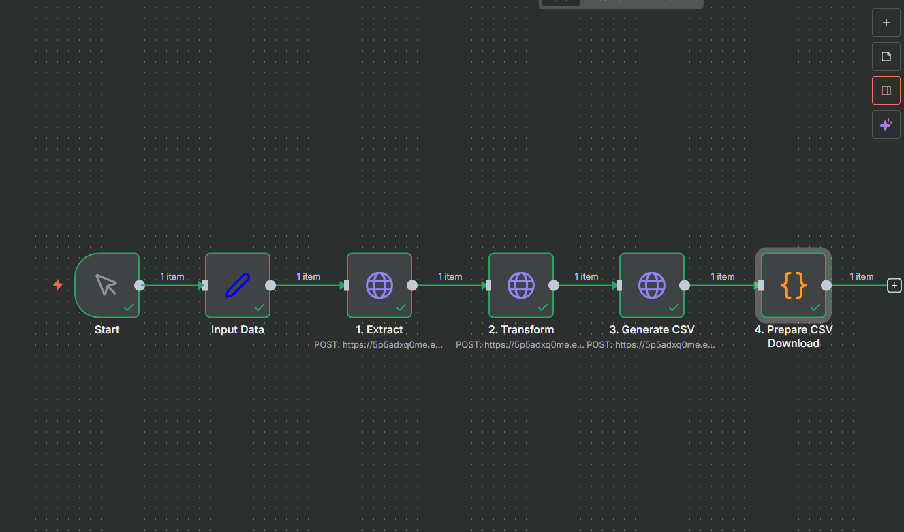

# Recursos de Flujo de Trabajo n8n

## 📁 Contenido

- **n8n_flow.png** - Diagrama visual del flujo completo
- **../N8N_INTEGRATION.md** - Guía completa de integración

## 🔄 Descripción del Flujo de Trabajo

El flujo de trabajo de n8n orquesta la API del Procesador de Emails a través de 5 nodos secuenciales:

1. **Start** - Trigger manual
2. **Input Data** - Definir emails y dominio objetivo
3. **Extract** - Llamar al endpoint `/extract`
4. **Transform** - Llamar al endpoint `/transform`
5. **Generate CSV** - Llamar al endpoint `/generate`
6. **Prepare Download** - Convertir a archivo CSV binario

## 📥 Importar Flujo de Trabajo

El JSON del flujo está ubicado en: `examples/n8n_workflow.json`

**Pasos:**
1. Abre n8n
2. Ve a **Workflows** → **Import from File**
3. Selecciona `examples/n8n_workflow.json`
4. Actualiza la API key en todos los nodos HTTP Request
5. Ejecuta el flujo de trabajo

## 🔗 Enlaces Rápidos

- **Documentación Completa:** [N8N_INTEGRATION.md](../N8N_INTEGRATION.md)
- **JSON del Flujo:** [n8n_workflow.json](../../examples/n8n_workflow.json)
- **Documentación de API:** [API_LAMBDA.md](../API_LAMBDA.md)

## 🎯 Casos de Uso

- Procesamiento por lotes programado de emails
- Flujos de subir archivo → procesar → descargar
- Integración con SharePoint, S3, servicios de email
- Procesamiento paralelo multi-dominio
- Flujos de aprobación con intervención humana

## 📊 Flujo Visual

El diagrama muestra el flujo completo de datos desde la entrada hasta la salida CSV, incluyendo llamadas a la API y transformaciones de datos.
