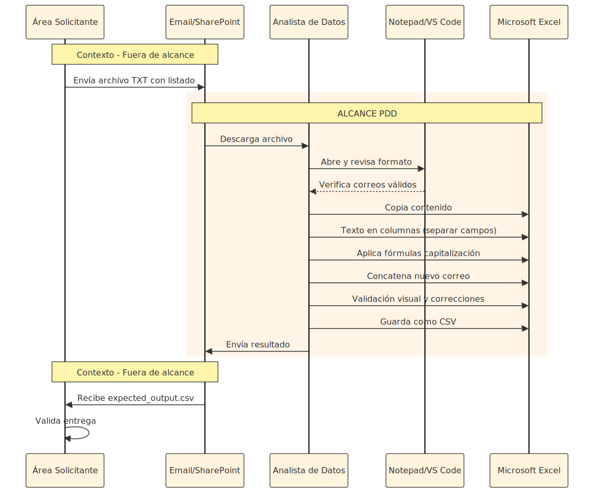
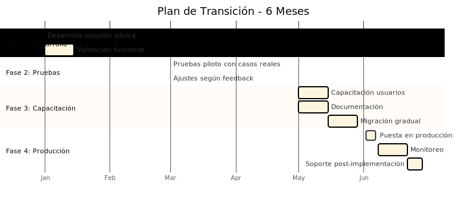

# Procesador de Migración de Dominio de Correos
## DOCUMENTO DE DEFINICIÓN DE PROCESO

---

## INFORMACIÓN GENERAL

**Nombre del Proceso:** Procesador de Migración de Dominio de Correos Electrónicos  
**Código/ID:** PDD-EMAIL-MIG-001  
**Área Responsable:** Departamento de TI / Operaciones  
**Versión:** 1.0  
**Fecha:** 2025-10-27  
**Autor:** Anderson Taguada  

**Objetivo:** Documentar el proceso de migración de correos entre dominios y establecer requerimientos funcionales. Este NO es un documento técnico, sino un puente entre negocio y equipo técnico que define QUÉ debe hacer el sistema (no CÓMO).

**Aprobaciones:**

| Rol | Nombre | Firma | Fecha |
|-----|--------|-------|-------|
| Analista de Procesos | Anderson Taguada | ✓ | 2025-10-27 |
| Usuario Funcional (SME) | - | - | 2025-10-27 |
| Área Solicitante | - | - | 2025-10-27 |
| Líder Técnico/Arquitecto | Anderson Taguada | ✓ | 2025-10-27 |
| Oficial de Seguridad (InfoSec) | - | - | 2025-10-27 |
| Oficial de Cumplimiento (DPO) | - | - | 2025-10-27 |
| Dueño de Negocio | - | - | 2025-10-27 |

---

## 1. DESCRIPCIÓN DEL PROCESO AS-IS

### 1.1 Resumen

**Propósito:** Transformar manualmente una lista de correos electrónicos corporativos para generar un nuevo listado con formato estandarizado y dominio actualizado.

**Descripción general:** El proceso es ejecutado por un analista de soporte administrativo o de datos, quien realiza las tareas utilizando herramientas de ofimática convencionales (Bloc de notas, Excel, y explorador de archivos).

**Flujo manual:**
1. Recepción del archivo fuente (.txt)
2. Revisión inicial en editor de texto
3. Extracción y separación de campos en Excel
4. Normalización de formato (capitalización)
5. Generación de nuevo correo (concatenación)
6. Validación final manual
7. Entrega del archivo resultado

**Inicio/Fin:**
- Inicio: Área solicitante envía archivo .txt por correo o carpeta compartida
- Fin: Analista entrega expected_output.csv al solicitante

**Diagrama de Macroproceso:**



**Diagrama de Swimlanes (Actores):**



### 1.2 Alcance



**Incluido:** Recepción de archivos, revisión manual, extracción de campos, normalización de formato, generación de nuevos correos, validación manual, entrega de resultados

**Excluido:** Migración real en servidores de correo, validación SMTP en vivo, notificaciones automáticas, gestión de usuarios en Active Directory

### 1.3 Entradas



| Tipo | Descripción | Formato | Origen |
|------|-------------|---------|--------|
| Archivo de texto | Lista de correos a migrar | sample_emails.txt (un correo por línea) | Correo electrónico o carpeta compartida |
| Dominio destino | Nuevo dominio corporativo | `nuevo.com` (sin @, solo dominio) | Parámetro proporcionado por solicitante |
| Instrucciones | Procedimiento o contexto | Documento o referencia | Correo electrónico |

**Formato esperado de correos:** `nombre.apellido@dominio.com`
**Validación de dominio destino:** Formato DNS válido (letras, números, guiones, puntos)

### 1.4 Salidas

| Tipo | Descripción | Formato | Contenido |
|------|-------------|---------|----------|
| Archivo CSV | Correos procesados exitosamente | expected_output.csv | Columnas: nombre, apellido, correo_original, correo_nuevo |
| Log de errores | Correos rechazados con razón | error_log.txt | Formato: `[TIMESTAMP] ERROR: {correo} - {regla_fallida} - {descripción}` |
| Reporte resumen | Estadísticas de ejecución | summary.txt | Total procesados, exitosos, rechazados, tiempo ejecución |

**Entrega:** Correo electrónico o carga a carpeta compartida

**Ejemplo log de errores:**
```
[2025-10-27 10:30:45] ERROR: john@example.com - BR-002 - Falta punto separador en prefijo
[2025-10-27 10:30:46] ERROR: maria.o'brien@example.com - BR-005 - Caracteres no permitidos (apóstrofe)
```

### 1.5 Actores

| Actor | Responsabilidad |
|-------|-----------------|
| Área Solicitante | Envía archivo fuente con listado de correos |
| Analista de Datos/Administrativo | Ejecuta proceso manual: recepción, validación, transformación, entrega |
| Destinatario | Recibe archivo resultado para uso posterior |

### 1.6 Métricas

| Métrica | Valor |
|---------|-------|
| Frecuencia | Ad-hoc, picos en fusiones/adquisiciones |
| Volumen típico | 100-1,000 correos por solicitud |
| Tiempo manual | 10-15 min (100 correos), 30-45 min (1000+ correos) |
| Errores humanos | 5-10% (capitalización, concatenación) |
| Reprocesos | 2-5% por validación incorrecta |

### 1.7 Excepciones Comunes

| Excepción | Frecuencia | Acción |
|-----------|------------|--------|
| Formato inválido | 5-10% | Log y omitir |
| Archivo no encontrado | <1% | Detener proceso |
| Sin permisos | <1% | Detener proceso |

### 1.8 Diagrama de Flujo Manual



**Leyenda:**
- 👤 **Responsable:** Actor que ejecuta la actividad
- ⏱️ **Tiempo:** Duración estimada de la actividad
- 📍 **Sistema/Herramienta:** Dónde se ejecuta la actividad

**Fases del proceso:**
1. **Recepción:** Obtención del archivo fuente
2. **Revisión:** Validación inicial de formato
3. **Procesamiento:** Transformación de datos en Excel
4. **Validación:** Revisión y corrección de errores
5. **Entrega:** Envío de resultados

---

## 2. PASOS DETALLADOS DEL PROCESO MANUAL

| # | Fase | Paso | Actor | Sistema | Duración | Resultado | Excepciones |
|---|------|------|-------|---------|----------|-----------|-------------|
| 1 | 📥 Recepción | Descargar archivo | Analista | Email/SharePoint | 1-2 min | Archivo TXT local | Archivo no encontrado, sin permisos |
| 2 | 🔍 Revisión | Verificar formato | Analista | Notepad/VS Code | 2-3 min | Formato validado | Formato incorrecto, caracteres especiales |
| 3 | ✂️ Extracción | Separar campos | Analista | Excel | 3-5 min | Nombre, Apellido, Dominio separados | Delimitadores incorrectos |
| 4 | 📝 Normalización | Capitalizar nombres | Analista | Excel | 5-10 min | Nombres con formato correcto | Nombres compuestos, errores ortográficos |
| 5 | 🔗 Generación | Concatenar correo | Analista | Excel | 3-5 min | Nuevos correos generados | Errores de concatenación |
| 6 | ✔️ Validación | Revisar resultados | Analista | Excel | 5-10 min | Datos validados y corregidos | Duplicados, datos faltantes |
| 7 | 📤 Entrega | Enviar CSV | Analista | Email/SharePoint | 2-3 min | expected_output.csv entregado | Error al guardar, problemas de red |

**Tiempo total estimado:** 22-43 minutos (tiempo base sin correcciones)

**Nota:** Para archivos grandes (1000+ correos) o con alta tasa de errores, el tiempo puede extenderse a 30-45 minutos incluyendo múltiples ciclos de corrección

---

## 3. REGLAS DE NEGOCIO

### 3.1 Validación

| ID | Tipo | Regla | Descripción | Acción si Falla |
|----|------|-------|-------------|------------------|
| BR-001 | 🔍 Estructura | Exactamente un @ | El correo debe contener un único símbolo @ | ❌ Registrar y omitir |
| BR-002 | 🔍 Estructura | Exactamente un punto en prefijo | La parte antes del @ debe tener un único punto separador | ❌ Registrar y omitir |
| BR-003 | 📏 Longitud | Nombre 2-50 caracteres | El nombre debe tener entre 2 y 50 caracteres | ❌ Registrar y omitir |
| BR-004 | 📏 Longitud | Apellido 2-50 caracteres | El apellido debe tener entre 2 y 50 caracteres | ❌ Registrar y omitir |
| BR-005 | 🔤 Caracteres | Solo letras | Nombre y apellido solo pueden contener letras (incluyendo á, é, í, ó, ú, ñ, ü) | ❌ Registrar y omitir |

**Nota:** Todas las validaciones se ejecutan en secuencia. Si alguna falla, el correo se registra en el log de errores y se omite del procesamiento.

### 3.2 Transformación

| ID | Tipo | Regla | Ejemplo Entrada | Ejemplo Salida |
|----|------|-------|-----------------|----------------|
| TR-001 | 📝 Formato | Capitalizar nombre | juan | Juan |
| TR-002 | 📝 Formato | Capitalizar apellido | perez | Perez |
| TR-003 | 📝 Formato | Minúsculas en correo | Juan.Perez@NUEVO.COM | juan.perez@nuevo.com |
| TR-004 | 💾 Preservación | Preservar dominio original | juan.perez@example.com | @example.com |
| TR-005 | 🔗 Generación | Aplicar nuevo dominio | Juan + Perez + @nuevo.com | juan.perez@nuevo.com |

**Nota:** Las transformaciones se aplican solo a correos que pasaron todas las validaciones.

### 3.3 Casos Especiales

| Caso | Ejemplo | Comportamiento Esperado | Regla Aplicada |
|------|---------|-------------------------|----------------|
| Nombres con apóstrofe | o'brien@example.com | ❌ Rechazar | BR-005 (solo letras) |
| Nombres con guión | maria-jose@example.com | ❌ Rechazar | BR-005 (solo letras) |
| Nombres compuestos (múltiples puntos) | maria.del.carmen@example.com | ❌ Rechazar | BR-002 (exactamente un punto) |
| Prefijo sin punto | admin@example.com | ❌ Rechazar | BR-002 (exactamente un punto) |
| Múltiples @ | user@@example.com | ❌ Rechazar | BR-001 (exactamente un @) |
| Caracteres acentuados | josé.garcía@example.com | ✅ Permitir | BR-005 (incluye á, é, í, ó, ú, ñ, ü) |
| Nombres muy cortos | a.b@example.com | ❌ Rechazar | BR-003/BR-004 (mínimo 2 caracteres) |
| Nombres muy largos | {nombre > 50 caracteres} | ❌ Rechazar | BR-003/BR-004 (máximo 50 caracteres) |
| Correos duplicados | juan.perez@example.com (2 veces) | ⚠️ Procesar una vez, alertar en log | Validación adicional |
| Archivo vacío | 0 correos en archivo | ⚠️ Generar CSV vacío, alertar en log | Validación adicional |
| Líneas vacías | Saltos de línea extra | ✅ Ignorar líneas vacías | Validación adicional |
| Espacios en blanco | " juan.perez@example.com " | ✅ Eliminar espacios antes/después | Validación adicional |
| Mayúsculas en dominio | juan.perez@EXAMPLE.COM | ✅ Convertir a minúsculas | TR-003 |
| Prefijos numéricos | juan.123@example.com | ❌ Rechazar | BR-005 (solo letras en apellido) |

**Leyenda:**
- ✅ Permitir: El correo se procesa normalmente
- ❌ Rechazar: El correo se registra en error_log.txt y se omite
- ⚠️ Alertar: Se procesa pero se genera advertencia en log

### 3.4 Dependencias

| Tipo | Proceso | Descripción |
|------|---------|---------------|
| ⬆️ Upstream | Extracción HR | Sistema de recursos humanos genera listado de empleados |
| ⬆️ Upstream | Aprobación cambio dominio | Área de TI aprueba migración de dominio |
| ⬇️ Downstream | Importación servidor correo | Administrador importa CSV al servidor de correo |
| ⬇️ Downstream | Notificación usuarios | Comunicación informa a usuarios sobre cambio |
| ⬇️ Downstream | Actualización AD | TI actualiza cuentas en Active Directory |

---

## 4. ANÁLISIS DE AUTOMATIZACIÓN

### 4.1 Porcentaje de Automatización

#### Evaluación por Paso

| # | Paso | Estado | Justificación | Complejidad |
|---|------|--------|---------------|-------------|
| 1 | 📥 Recepción | 🟩 Automatizable | Lectura de archivos es tarea repetitiva y estructurada | 🟢 Baja |
| 2 | 🔍 Revisión | 🟩 Automatizable | Validación de formato sigue reglas definidas (BR-001 a BR-005) | 🟢 Baja |
| 3 | ✂️ Extracción | 🟩 Automatizable | Separación de campos con delimitadores fijos (. y @) | 🟢 Baja |
| 4 | 📝 Normalización | 🟩 Automatizable | Capitalización es función estándar de texto | 🟢 Baja |
| 5 | 🔗 Generación | 🟩 Automatizable | Concatenación sigue patrón fijo: nombre.apellido@dominio | 🟢 Baja |
| 6 | ✔️ Validación | 🟩 Automatizable | Verificación de duplicados y vacíos es lógica simple | 🟢 Baja |
| 7 | 📤 Entrega | 🟩 Automatizable | Guardado de CSV y envío por API/email es estándar | 🟢 Baja |

**Leyenda de complejidad:**
- 🟢 Baja: Implementación directa, sin lógica compleja
- 🟡 Media: Requiere manejo de excepciones o integraciones
- 🔴 Alta: Requiere IA, ML o lógica de negocio compleja

#### Resumen de Automatización

| Métrica | Valor Actual (Manual) | Valor Esperado (Automatizado) | Mejora |
|---------|----------------------|-------------------------------|--------|
| 🟩 Pasos automatizables | 0/7 (0%) | 7/7 (100%) | +100% |
| 🟥 Pasos manuales | 7/7 (100%) | 0/7 (0%) | -100% |
| ⏱️ Tiempo de ejecución | 30-45 min | 3-5 min | -85% |
| ❌ Tasa de error | 5-10% | <1% | -90% |
| 📈 Capacidad diária | 1,000 correos | 10,000+ correos | +900% |
| 📊 Trazabilidad | 0% (manual) | 100% (logs) | +100% |

### 4.2 Heatmap de Automatización


### 4.3 Capacidades Requeridas para Automatización

| Paso | Actividad Manual Actual | Capacidad Automatizada Requerida | Beneficio Esperado |
|------|-------------------------|-----------------------------------|--------------------|
| 📥 Recepción | Descarga manual desde Email/SharePoint | Integración automática con sistemas de origen | Elimina descarga manual, reduce tiempo de inicio |
| 🔍 Revisión | Revisión visual en editor de texto | Motor de validación con reglas de negocio | Elimina errores humanos, validación consistente |
| ✂️ Extracción | Separación manual en Excel | Procesador de texto con análisis de estructura | Procesamiento rápido y sin errores |
| 📝 Normalización | Aplicación manual de fórmulas | Motor de transformación de texto | Consistencia 100%, sin variaciones |
| 🔗 Generación | Concatenación manual en Excel | Generador automático con plantillas | Formato estandarizado, sin errores de tipeo |
| ✔️ Validación | Revisión visual fila por fila | Motor de validación con reglas de negocio | Validación exhaustiva, detección de duplicados |
| 📤 Entrega | Envío manual por correo/carga a carpeta | Integración automática con sistemas destino | Entrega instantánea, trazabilidad completa |

**Capacidades transversales requeridas:**
- **Registro de auditoría:** Cada operación debe quedar registrada con timestamp y resultado
- **Manejo de excepciones:** Sistema debe identificar y reportar correos que no cumplen reglas
- **Reportería:** Generación automática de estadísticas de procesamiento
- **Trazabilidad:** Capacidad de rastrear el origen y destino de cada correo procesado

### 4.4 Exclusiones (Out of Scope)

| Componente | Razón de Exclusión | Tipo | Responsable |
|------------|----------------------|------|-------------|
| 🚫 Aprobación migración | Decisión estratégica de negocio | 👤 Manual | Dueño de Negocio |
| 🚫 Validación dominio destino | Verificación administrativa y legal | 👤 Manual | Área de TI |
| 🚫 Resolución conflictos | Requiere criterio y contexto humano | 👤 Manual | Analista |
| 🚫 Migración real servidores | Proceso separado con sus propios controles | 🔗 Otro proceso | Administrador Sistemas |
| 🚫 Notificaciones usuarios | Comunicación corporativa formal | 👤 Manual | Área de Comunicación |
| 🚫 Backup y recuperación | Responsabilidad de infraestructura | 🔗 Otro proceso | Operaciones TI |

**Leyenda:**
- 👤 Manual: Requiere intervención humana
- 🔗 Otro proceso: Fuera del alcance, gestionado por otro flujo
- 🚫 Excluido: No forma parte de este proceso

### 4.5 Restricciones del Proceso Actual (AS-IS)

**Operativas:** Proceso 100% manual, no escalable, dependiente de disponibilidad del analista  
**Datos:** Solo formato nombre.apellido@dominio, caracteres latinos, longitud razonable  
**Seguridad:** Archivos manejados localmente en estaciones de trabajo, riesgo de exposición  
**Negocio:** Requiere aprobación previa, ventanas de mantenimiento, auditoría manual

**Nota:** Estas restricciones aplican al proceso manual actual. La automatización (TO-BE) eliminará la mayoría de estas limitaciones

---

## 5. DISEÑO TO-BE (VISIÓN FUTURA)

### 5.1 Proceso Automatizado (TO-BE)



**Visión del proceso automatizado:**

El proceso TO-BE elimina todas las tareas manuales mediante un sistema automatizado que:

1. **Recepción automática:** Detecta archivos nuevos sin intervención humana
2. **Validación instantánea:** Aplica reglas BR-001 a BR-005 automáticamente
3. **Transformación consistente:** Ejecuta reglas TR-001 a TR-005 sin errores
4. **Generación automática:** Produce archivos de salida en formato requerido
5. **Notificación inmediata:** Alerta al solicitante al completar

**Beneficios esperados:**
- 🤖 **Automatización completa:** Sin intervención manual
- ⚡ **Reducción de tiempo:** 3-5 minutos (vs 30-45 minutos manual)
- 📊 **Mayor capacidad:** 10,000+ correos/día (vs 1,000 manual)
- 📝 **Trazabilidad total:** Registro automático de cada operación
- ✅ **Mayor precisión:** Tasa de error <1% (vs 5-10% manual)

### 5.2 Comparativa AS-IS vs TO-BE

| Aspecto | 🔴 AS-IS (Manual) | 🟢 TO-BE (Automatizado) | 📈 Mejora |
|---------|-------------------|------------------------|----------|
| **Ejecución** | Manual en Excel | Automatizada | -85% tiempo |
| **Validación** | Visual, propensa a errores | Reglas automáticas (BR-001 a BR-005) | -90% errores |
| **Escalabilidad** | Limitada (1,000 correos/día) | Alta (10,000+ correos/día) | 10x capacidad |
| **Trazabilidad** | Capturas manuales | Logs automáticos | 100% auditable |
| **Disponibilidad** | Horario laboral | 24/7 | 3x disponibilidad |
| **Costo operativo** | Alto (tiempo analista) | Bajo (infraestructura) | -70% costo |

### 5.3 Plan de Transición (4 meses)



#### Detalle por Fase

**🟦 Fase 1: Desarrollo (Mes 1)**
- Desarrollo de solución automatizada básica
- Implementación de reglas de negocio (BR-001 a BR-005, TR-001 a TR-005)
- Validación funcional con casos de prueba
- **Entregable:** Prototipo funcional

**🟨 Fase 2: Pruebas (Mes 2)**
- Pruebas piloto con casos reales (100-500 correos)
- Identificación y corrección de errores
- Ajustes según feedback de usuarios
- Pruebas de carga y rendimiento
- **Entregable:** Solución validada y ajustada

**🟩 Fase 3: Capacitación (Mes 3)**
- Capacitación a usuarios finales
- Creación de documentación técnica y de usuario
- Migración gradual (20% → 50% → 100%)
- Soporte paralelo (manual + automatizado)
- **Entregable:** Usuarios capacitados y documentación completa

**🟦 Fase 4: Producción (Mes 4)**
- Puesta en producción al 100%
- Monitoreo continuo de métricas
- Soporte post-implementación
- Optimizaciones basadas en uso real
- **Entregable:** Sistema en producción estable

#### Criterios de Éxito

| Fase | Criterio | Meta |
|------|----------|------|
| Fase 1 | Funcionalidad básica | 100% reglas implementadas |
| Fase 2 | Tasa de éxito | >95% correos procesados correctamente |
| Fase 3 | Adopción | 100% usuarios capacitados |
| Fase 4 | Estabilidad | <1% tasa de error en producción |

---

## 6. RIESGOS Y CONSIDERACIONES

### 6.1 Matriz de Riesgos

#### Matriz Probabilidad vs Impacto

|  | **🟢 Bajo Impacto** | **🟡 Medio Impacto** | **🔴 Alto Impacto** | **⚫ Crítico** |
|---|---|---|---|---|
| **🔴 Alta Probabilidad** | 🟨 Medio<br/>Planificar | 🟧 Alto<br/>Monitorear | 🟥 Crítico<br/>Mitigar urgente | 🟥 Crítico<br/>Mitigar urgente |
| **🟡 Media Probabilidad** | 🟩 Bajo<br/>Aceptar | 🟨 Medio<br/>Planificar | 🟨 Medio<br/>📄 Archivo corrupto<br/>❌ Datos incorrectos<br/>🔒 Exposición PII | 🟧 Alto<br/>Monitorear |
| **🟢 Baja Probabilidad** | 🟩 Bajo<br/>Aceptar | 🟩 Bajo<br/>Aceptar | 🟧 Alto<br/>🚫 Acceso no autorizado<br/>⚡ Fallo infraestructura | 🟧 Alto<br/>💾 Pérdida datos |

**Leyenda de niveles de riesgo:**
- 🟥 **Crítico:** Mitigar urgentemente antes de producción
- 🟧 **Alto:** Monitorear continuamente, plan de contingencia
- 🟨 **Medio:** Planificar mitigación en roadmap
- 🟩 **Bajo:** Aceptar, revisar periódicamente

### 6.2 Riesgos Operativos

| Riesgo | Probabilidad | Impacto | Nivel | Mitigación Propuesta |
|--------|--------------|---------|-------|-------------------------|
| 📄 Archivo corrupto | 🟡 Media | 🔴 Alto | 🟨 Medio | Validación previa con try-catch, logs detallados |
| 💾 Pérdida datos | 🟢 Baja | 🔴 Crítico | 🟧 Alto | Logs completos, backup automático, sin borrado de origen |
| ❌ Datos incorrectos | 🟡 Media | 🔴 Alto | 🟨 Medio | Validación estricta (BR-001 a BR-005), reporte de errores |
| 🚫 Acceso no autorizado | 🟢 Baja | 🔴 Alto | 🟧 Alto | Implementar autenticación y control de acceso |
| 🔒 Exposición de PII | 🟡 Media | 🔴 Alto | 🟨 Medio | Sin persistencia, logs sanitizados, encriptación en tránsito |
| ⚡ Fallo infraestructura | 🟢 Baja | 🔴 Alto | 🟧 Alto | Reintentos automáticos, monitoreo, alertas |

**Leyenda de probabilidad:**
- 🟢 Baja: <20% de ocurrencia
- 🟡 Media: 20-60% de ocurrencia
- 🔴 Alta: >60% de ocurrencia

**Leyenda de impacto:**
- 🟢 Bajo: Sin impacto significativo en operaciones
- 🟡 Medio: Impacto moderado, recuperable
- 🔴 Alto: Impacto severo en operaciones
- ⚫ Crítico: Pérdida de datos o incumplimiento legal

### 6.3 Cumplimiento Normativo

| Normativa | Requisito | Estado Propuesto | Acción Requerida | Prioridad |
|-----------|-----------|------------------|-------------------|----------|
| 🇪🇺 **GDPR/LOPD** | Protección datos personales | Sin almacenamiento permanente | Limitar retención logs a 90 días | 🟡 Media |
| 🇪🇺 **GDPR/LOPD** | Derecho al olvido | Datos no persistidos | Cumple por diseño | 🟢 Baja |
| 📊 **SOX** | Trazabilidad de operaciones | Logs completos con timestamps | Cumple por diseño | 🟢 Baja |
| 🔒 **ISO 27001** | Control de acceso | Requiere implementación | Implementar autenticación y roles | 🔴 Alta |
| 🔒 **ISO 27001** | Encriptación de datos | Solo en tránsito | Encriptar logs sensibles | 🟡 Media |
| 📝 **Auditoría interna** | Registros de cambios | Logs automáticos | Cumple por diseño | 🟢 Baja |

**Leyenda de prioridad:**
- 🔴 Alta: Implementar antes de producción
- 🟡 Media: Implementar en primeros 2 meses
- 🟢 Baja: Mejora continua

### 6.4 Riesgos de Seguridad

| Amenaza | Descripción | Impacto | Mitigación Propuesta |
|---------|-------------|---------|----------------------|
| 🔓 **Exposición datos personales** | Correos contienen PII (nombres, emails) | 🔴 Alto | Sin persistencia, logs sanitizados, encriptar logs, anonimizar reportes |
| 🚪 **Acceso no autorizado** | Sin control de quién ejecuta el proceso | 🔴 Alto | Autenticación (OAuth/LDAP), control de roles |
| 💩 **Inyección de código** | Entrada maliciosa en archivos | 🟡 Medio | Validación estricta de formato, sanitización de entrada, whitelist de caracteres |
| 🔍 **Fuga de información** | Logs con datos sensibles | 🟡 Medio | Logs centralizados con acceso restringido |
| 🛡️ **Denegación de servicio** | Archivos muy grandes bloquean proceso | 🟢 Bajo | Timeout, límite de tamaño de archivo (10MB), rate limiting |
| 🔧 **Manipulación de datos** | Modificación de archivo durante proceso | 🟢 Bajo | Lectura única, checksum/hash de archivo, validación de integridad |

**Recomendaciones de seguridad prioritarias:**
1. 🔴 **Urgente:** Implementar autenticación y control de acceso
2. 🟡 **Importante:** Encriptar logs con datos sensibles
3. 🟡 **Importante:** Centralizar logs con acceso restringido
4. 🟢 **Deseable:** Implementar checksum para validación de integridad

---

## 7. HERRAMIENTAS Y SISTEMAS

### 7.1 Herramientas Actuales (AS-IS)

| Herramienta | Uso |
|-------------|-----|
| Microsoft Excel | Separación de campos, fórmulas, concatenación |
| Bloc de Notas / VS Code | Revisión inicial de formato |
| Correo corporativo | Recepción y envío de archivos |
| Carpeta compartida | SharePoint o red local para transferencia |

### 7.2 Sistemas Relacionados

| Sistema | Relación |
|---------|----------|
| Sistema HR | Fuente de datos de empleados |
| Servidor de correo | Destino final de la migración |
| Active Directory | Actualización de cuentas de usuario |

---

## 8. APÉNDICE

### 8.1 Ejemplo Entrada
```
juan.perez@oldcompany.com
maria.garcia@oldcompany.com
```

### 8.2 Ejemplo Salida CSV
```csv
nombre,apellido,correo_original,correo_nuevo
Juan,Perez,juan.perez@old.com,juan.perez@new.com
Maria,Garcia,maria.garcia@old.com,maria.garcia@new.com
```

### 8.3 Glosario

**PDD:** Process Definition Document  
**AS-IS:** Estado actual del proceso (manual)  
**TO-BE:** Estado futuro deseado (automatizado)  
**SME:** Subject Matter Expert (Experto en la materia)  
**CSV:** Comma-Separated Values (Valores separados por comas)  
**HR:** Human Resources (Recursos Humanos)

### 8.4 Referencias

- Procedimiento interno de migración de correos
- Política de seguridad de datos corporativos
- Estándares de nomenclatura de correos electrónicos

---

## 9. HISTORIAL DE REVISIONES

### 9.1 Sesiones de Validación

| Fecha | Sesión | Participantes | Temas Revisados | Feedback Recibido | Estado |
|-------|---------|---------------|-----------------|-------------------|--------|
| 2025-10-20 | Kick-off | Analista, SME, Negocio | Alcance inicial, proceso AS-IS | Validar métricas actuales | ✅ Incorporado |
| 2025-10-22 | Revisión técnica | Analista, Líder Técnico | Reglas de negocio, casos especiales | Agregar validación de duplicados | ✅ Incorporado |
| 2025-10-25 | Revisión seguridad | Analista, InfoSec, DPO | Riesgos de seguridad, cumplimiento | Encriptar logs, limitar retención | ✅ Incorporado |
| 2025-10-27 | Aprobación final | Todos los stakeholders | Documento completo | Aprobado para desarrollo | ✅ Aprobado |

### 9.2 Cambios Principales

| Versión | Fecha | Cambio | Razón | Solicitado Por |
|---------|-------|--------|--------|----------------|
| 0.1 | 2025-10-15 | Versión inicial | Documentación proceso AS-IS | Anderson Taguada |
| 0.2 | 2025-10-20 | Agregados casos especiales | Cubrir escenarios edge case | Anderson Taguada |
| 0.3 | 2025-10-25 | Agregados controles de seguridad | Cumplimiento GDPR/ISO 27001 | Anderson Taguada |
| 1.0 | 2025-10-27 | Versión aprobada | Listo para desarrollo | Anderson Taguada |

### 9.3 Criterios de Aceptación por Stakeholder

| Stakeholder | Criterio de Aceptación | Estado |
|-------------|--------------------------|--------|
| Usuario Funcional (SME) | Proceso AS-IS refleja realidad actual | ✅ Aprobado |
| Área Solicitante | Salidas cumplen necesidades del negocio | ✅ Aprobado |
| Líder Técnico | Reglas de negocio son implementables | ✅ Aprobado |
| Oficial de Seguridad | Controles de seguridad son adecuados | ✅ Aprobado |
| Oficial de Cumplimiento | Cumple normativas GDPR/LOPD/ISO 27001 | ✅ Aprobado |
| Dueño de Negocio | ROI justifica inversión en automatización | ✅ Aprobado |

**Leyenda:**
- ✅ Aprobado: Stakeholder ha validado y aprobado
- ⏳ Pendiente validación: Requiere revisión y aprobación
- ❌ Rechazado: Requiere cambios antes de aprobar

---

## FIRMAS Y VALIDACIÓN

**Analista de Procesos:** Anderson Taguada Fecha: 2025-10-27  
**Usuario Funcional (SME):** _________________ Fecha: 2025-10-27  
**Líder Técnico:** Anderson Taguada Fecha: 2025-10-27  
**Dueño de Negocio:** _________________ Fecha: 2025-10-27

---

**Control de Versiones**

| Versión | Fecha | Autor | Cambios | Aprobado Por |
|---------|-------|-------|---------|--------------|
| 0.1 | 2025-10-15 | Anderson Taguada | Versión inicial - Proceso manual AS-IS | - |
| 0.2 | 2025-10-20 | Anderson Taguada | Agregados casos especiales (sección 3.3) | Anderson Taguada |
| 0.3 | 2025-10-23 | Anderson Taguada | Clarificadas entradas/salidas, formato de logs | Anderson Taguada |
| 0.4 | 2025-10-25 | Anderson Taguada | Agregados stakeholders de seguridad y cumplimiento | Anderson Taguada |
| 1.0 | 2025-10-27 | Anderson Taguada | Versión completa para aprobación | Anderson Taguada |
